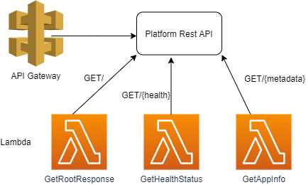

# Platform Enablement Technical Test

## Description

This project aims at creating a simple, small, operable web-style API or service provider application. The application is packaged with its dependencies and will build continuously on each commit.

## Table of Contents

- [Requirements](#requirements)
- [Assumptions](#assumptions)
- [Required Tools](#required-tools)
- [Quick Start](#quick-start)
- [Solution Overview](#solution-overview)
- [Contributors](#contributors)

## Requirements

The project should implement the following:

- a simple root endpoint which responds in a simple manner; "hello world" or some such.
- a health endpoint which returns an appropriate response code.
- a metadata endpoint which returns basic information about your application.

## Required Tools

- Install [Git](https://git-scm.com/book/en/v2/Getting-Started-Installing-Git).

- Install [AWS CLI](https://docs.aws.amazon.com/cli/latest/userguide/cli-chap-install.html)

- Install [Docker](https://docs.docker.com/get-docker/)

  - Related tool:

    - [Docker Compose](https://docs.docker.com/compose/install/)

- Clone the repository and get inside it:

```
git clone git@github.com:nimmi89/ops-technical-test.git
cd ops-technical-test
```

** Check if you have permission to clone the repository via SSH, or insert your ssh-key on your github([more details here](https://help.github.com/en/github/authenticating-to-github/adding-a-new-ssh-key-to-your-github-account)).

## Quick Start

Installing from your Local Machine

1. Install Required Tools (as above)
2. Export the variables given in .env file in root So, according to this example

  ```bash
  export AWS_ACCESS_KEY_ID="your_access_key"
  export AWS_SECRET_ACCESS_KEY="your_secret"
  ```

3. Run `make init` [Initialize a working directory containing Terraform configuration files.]

4. Run `make plan` [Performs a refresh and determines actions necessary to achieve the desired state specified in the configuration files]
5. Run `make deploy` [Applies the plan to create the resources]. Alternatively, you can skip steps 3 and 4 and directly run this.
6. Note that the application puts the git commit sha and version in the [AWS systems manager store](https://docs.aws.amazon.com/systems-manager/latest/userguide/systems-manager-parameter-store.html) to be consumed by the application endpoint. The target which it uses is `make ssm-put`.
7. Run 'make test' to see if the APIs are created and run succcessfully.
8. Finally, clean your environment by running `make clean`. It destroys all the resources.

## Solution Overview

The solution has used AWS services like [API Gateway](https://aws.amazon.com/api-gateway/), [Lambda](https://aws.amazon.com/lambda/), SSM parameter store, [CloudWatch](https://aws.amazon.com/cloudwatch/). It creates these AWS resources using the concept of Infrastructure as Code[IAC] with the help of [Terraform](https://www.terraform.io/)

The API gateway endpoint is integrated with different lambda functions written in python in [src/ folder](./src) to process the resources as per [Requirements](#requirements). [IAM](https://docs.aws.amazon.com/IAM/latest/UserGuide/introduction.html) is used to securely access these AWS services.

The solution is then organized as per the [3 Musketeers Approach](https://3musketeers.io/) which comprises of Docker, Docker-Compose and Make. The environment variables are injected into the container using the .env file. This makes it easier to build and run your application irrespective of the environment.

The solution also includes a CICD pipleine to build the application on each commit using [Github Actions](https://docs.github.com/en/free-pro-team@latest/actions). The workflow for this is defined in the folder `.github/workflows` in the root directory. In this case, you need to set your AWS credentials using [Secrets](https://docs.github.com/en/free-pro-team@latest/actions/reference/encrypted-secrets) .

Finally , you can test your solution by running the test script written in bash using make target `make test`.

The solution diagram is shown below:




## Associated Risks and Scenarios

- Docker or docker-Compose should be run as root `sudo service docker start` or add user to the docker user group.
- In this solution, the API gateway has been autorized with an API key which is a hash code generated while creating the key and its value is stored in SSM parameter store. While testing the APIs, the API key needs to be fetched from SSM and then included with the API url.
- There is a risk of complexity since all the API rules are in one place.
- When you deploy an API to API Gateway, throttling is enabled by default in the stage configurations. All your APIs in the entire region share a rate limit that can be exhausted by a single method incase of a DOS Attack.

## Contributors

- Nimmi (nimmi89)
